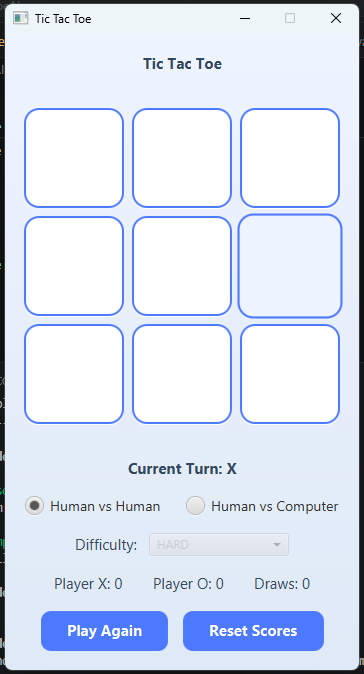
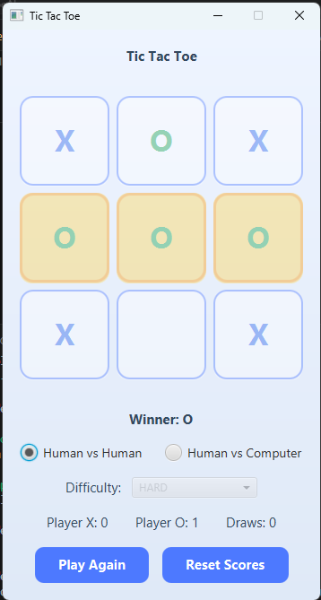
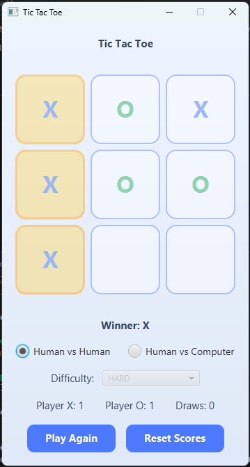
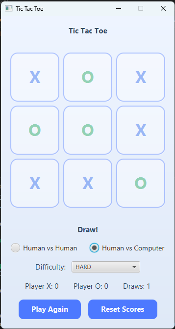

# Tic Tac Toe AI

A desktop Tic Tac Toe game built using **Java 21**, **JavaFX 21**, and **Maven**. This project started as a simple two-player game and was gradually improved by adding an AI opponent, multiple difficulty levels, score tracking, and a cleaner user interface while following the **MVC (Model-View-Controller)** architecture.

---

## Features

- Play against another player or the computer
- Three AI difficulty levels:
  - Easy (Random moves)
  - Medium (Mix of smart and random moves)
  - Hard (Minimax AI)
- Detects wins and draws
- Highlights the winning combination
- Keeps track of Player X wins, Player O wins, and draws
- Play Again option without losing the score
- Reset Scores option to start a new session
- Clean JavaFX interface with custom styling

---

## Technologies Used

- Java 21
- JavaFX 21
- Maven
- CSS
- MVC Architecture
- Minimax Algorithm

---

## Project Structure

```
src
├── ai
├── controller
├── model
├── service
├── view
└── resources
```

---

## How to Run

### Option 1 – Download the Application (Recommended)

If you just want to play the game:

1. Open the **Releases** section of this repository.
2. Download the latest **TicTacToe.zip** file.
3. Extract the ZIP file.
4. Open the extracted folder and double-click **TicTacToe.exe**.

No additional Java installation is required.

### Option 2 – Run from Source

If you'd like to build and run the project yourself:

```bash
git clone https://github.com/Janish888/TicTacToe.git
cd TicTacToe
mvn clean javafx:run
```

Make sure you have **Java 21** and **Maven** installed before running the project.

---

## How to Play

### Human vs Human

Two players take turns placing **X** and **O** until someone wins or the game ends in a draw.

### Human vs Computer

Play against the computer by choosing one of the available difficulty levels.

- **Easy** – Random moves
- **Medium** – Mostly smart moves with some randomness
- **Hard** – Uses the Minimax algorithm and never loses

---

## Screenshots

| | |
|:-:|:-:|
|  |  |
|  |  |

---

## Project Highlights

Working on this project helped me understand:

- JavaFX application development
- MVC architecture
- Object-Oriented Programming
- Event-driven programming
- AI using the Minimax algorithm
- Organizing a Java project with Maven
- Separating UI from business logic

---

## Future Improvements

Some ideas that could be added in the future:

- Sound effects
- Themes (Dark/Light mode)
- Animations
- Online multiplayer
- Game statistics
- Undo move

---

## Author

**Janish J**


GitHub: https://github.com/Janish888